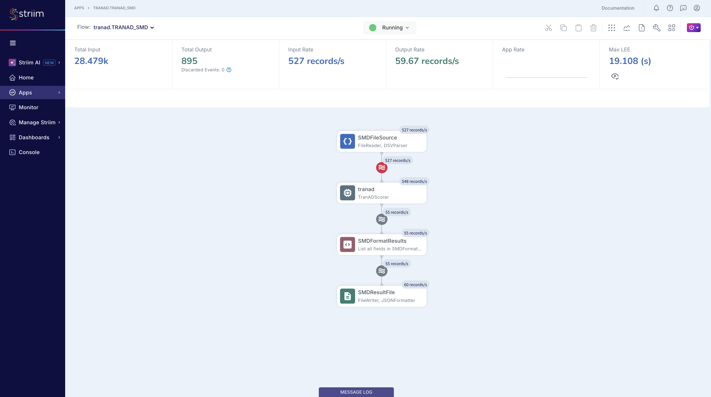
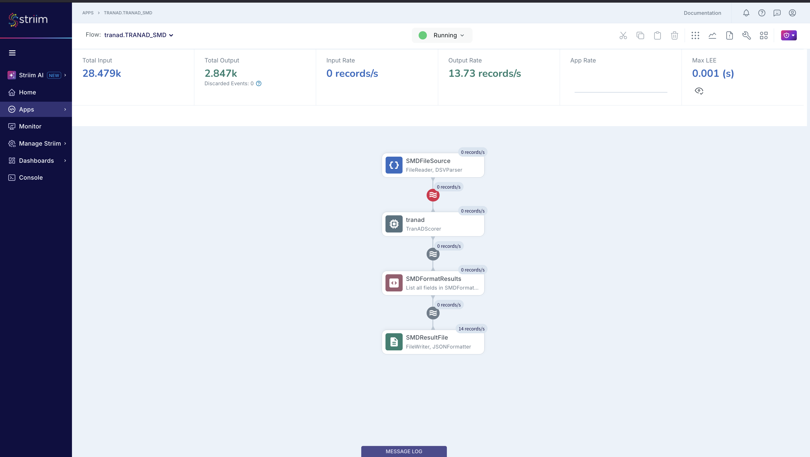

# Striim TranAD Anomaly Detection Pipeline: Setup Guide

**Striim Version:** Platform 5.2.0.4 (OpenJDK 11)
**Pipeline:** FileReader -> Open Processor (buffering + TranAD API scoring) -> Format CQ -> FileWriter (JSON)

This guide walks through setting up the end-to-end Striim TranAD multivariate anomaly detection pipeline. The pipeline ingests Server Machine Dataset (SMD) telemetry data (38 features per timestep), buffers 10-row non-overlapping windows inside the Open Processor, scores each window against a pre-trained TranAD transformer model via HTTP, and writes anomaly results with per-feature attribution to JSON.

This uses the **WAEvent pass-through pattern**: no typed streams, no types JAR, no `CREATE TYPE` statements.

---

## Table of Contents

1. [Prerequisites](#1-prerequisites)
2. [Start the Scoring API](#2-start-the-scoring-api)
3. [Build the Open Processor](#3-build-the-open-processor)
4. [Deploy to Striim](#4-deploy-to-striim)
5. [Wire the Open Processor in Flow Designer](#5-wire-the-open-processor-in-flow-designer)
6. [Run and Verify](#6-run-and-verify)
7. [Results](#7-results)
8. [Teardown and Re-runs](#8-teardown-and-re-runs)

---

## 1. Prerequisites

| Requirement | Detail |
|---|---|
| Striim Platform | 5.2.0.4, installed at `$STRIIM_HOME` (e.g. `/opt/Striim`) |
| Java | OpenJDK 11 |
| Python | 3.11+ with `fastapi`, `uvicorn`, `torch`, `numpy`, `pandas` |
| Maven | 3.9+ for building the Open Processor |

Set `STRIIM_HOME`:

```bash
export STRIIM_HOME="/opt/Striim"
```

Key artifacts:

| Artifact | Path | Purpose |
|---|---|---|
| OP source | `striim/tranad-scorer/` | Striim Open Processor (Java, WAEvent pass-through) |
| TQL | `striim/TRANAD.tql` | Striim application definition |
| Test data | `data/smd/raw/test/machine-1-1.txt` | Raw SMD test data (38 comma-separated floats per line) |
| Scoring API | `code/3_streaming_app.py` | FastAPI service wrapping the TranAD model |

---

## 2. Start the Scoring API

The scoring API must be running before the Striim application starts:

```bash
cd <repo>
docker compose -f docker-compose.rest.yml up --build
```

Or without Docker:

```bash
uv run uvicorn code.3_streaming_app:app --port 8000
```

Verify:

```bash
curl -s http://localhost:8000/health | python -m json.tool
```

Expected:
```json
{
    "status": "ready",
    "detector": "tranad",
    "available_devices": [{"store_id": 1, "device_id": 1}],
    "loaded_devices": [...]
}
```

Leave this running in a separate terminal.

---

## 3. Build the Open Processor

```bash
cd <repo>/striim/tranad-scorer
chmod +x build.sh
./build.sh
```

This installs Striim SDK + Common JARs into the local Maven repo, builds the fat JAR, and copies `TranADScorer.scm` to `$STRIIM_HOME/modules/`.

---

## 4. Deploy to Striim

### 4.1 Start Striim (if not already running)

```bash
export JAVA_HOME=/opt/homebrew/opt/openjdk@11
cd $STRIIM_HOME && bin/server.sh
```

### 4.2 Clear OP cache (if rebuilding)

```bash
rm -rf $STRIIM_HOME/.striim/OpenProcessor/TranADScorer.scm
```

### 4.3 Load the Open Processor

In the Striim console:

```sql
LOAD OPEN PROCESSOR "/opt/Striim/modules/TranADScorer.scm";
```

Verify:

```sql
LIST OPENPROCESSORS;
```

`TranADScorer` should appear in the list.

### 4.4 Import the TQL application

Paste the contents of `striim/TRANAD.tql` into the Striim console. All statements should return `SUCCESS`.

---

## 5. Wire the Open Processor in Flow Designer

This is the only step that cannot be done in TQL.

1. In the Striim web UI, navigate to **Apps** and open `tranad.TRANAD_SMD`
2. Click to enter **Flow Designer**
3. Drag **Striim Open Processor** from the Base Components palette into the workspace
4. Configure:
   - **Name:** `tranad_scorer` (or any name)
   - **Module:** Select `TranADScorer` from the dropdown
   - **Input Stream:** `SMDRawStream`
   - **Output Stream:** `SMDResultStream`
5. Click **Save**

---

## 6. Run and Verify

### 6.1 Deploy and start

```sql
USE tranad;
DEPLOY APPLICATION tranad.TRANAD_SMD;
START APPLICATION tranad.TRANAD_SMD;
```

### 6.2 Copy data file (after app is running)

**Important:** Copy the file AFTER the app starts. FileReader ignores files that already exist when the application launches. The raw `.txt` files are used directly — no conversion needed.

```bash
mkdir -p /tmp/tranad_test
cp <repo>/data/smd/raw/test/machine-1-1.txt /tmp/tranad_test/
```

### 6.3 Monitor

**Striim server log:**

```bash
grep "TranADScorer" $STRIIM_HOME/logs/striim.server.log | grep "Scored" | tail -10
```

**Flow Designer** -- open the app in the web UI to see record counts on each node.

During ingestion, the pipeline processes at ~500+ records/s through the OP:



After ingestion completes, Total Output should show **2,847** (28,479 rows / 10-row windows):



**Output files:**

```bash
ls -la /tmp/tranad_test/scored_output*
cat /tmp/tranad_test/scored_output.00
```

---

## 7. Results

With machine-1-1 test data (28,479 rows x 38 features):

| Metric | Value |
|---|---|
| Input records | 28,479 |
| Windows scored | ~2,847 (non-overlapping, window size 10) |
| Expected anomaly rate | ~9.46% |
| Model F1 score | 0.921 |
| Threshold method | POT (Peaks Over Threshold) |

### Output fields

| Field | Description |
|---|---|
| `is_anomaly` | "true" / "false" |
| `n_anomalies` | Number of anomalous timesteps in the window |
| `threshold` | POT threshold value |
| `anomaly_ratio` | Fraction of anomalous timesteps |
| `window_start_idx` | First row index in window |
| `window_end_idx` | Last row index in window |
| `top_dimension` | Highest-attributed feature (e.g. "dim_9") |
| `top_elevation` | Mean elevation of top dimension above baseline |

### Example JSON output

Normal window:
```json
{
  "is_anomaly": "false",
  "n_anomalies": "0",
  "threshold": "0.004532",
  "anomaly_ratio": "0.0",
  "window_start_idx": "0",
  "window_end_idx": "9",
  "top_dimension": "",
  "top_elevation": ""
}
```

Anomaly window:
```json
{
  "is_anomaly": "true",
  "n_anomalies": "3",
  "threshold": "0.004532",
  "anomaly_ratio": "0.3",
  "window_start_idx": "8500",
  "window_end_idx": "8509",
  "top_dimension": "dim_9",
  "top_elevation": "12.3"
}
```

---

## 8. Teardown and Re-runs

### Stop the application

```sql
USE tranad;
STOP APPLICATION tranad.TRANAD_SMD;
UNDEPLOY APPLICATION tranad.TRANAD_SMD;
```

### Re-run with same data

FileReader tracks files by name. Use a unique filename for each run:

```bash
rm -f /tmp/tranad_test/scored_output*
rm -f /tmp/tranad_test/machine*.txt
cp <repo>/data/smd/raw/test/machine-1-1.txt /tmp/tranad_test/machine-1-1_run2.txt
```

Then redeploy and start:

```sql
DEPLOY APPLICATION tranad.TRANAD_SMD;
START APPLICATION tranad.TRANAD_SMD;
```

### Full reset

```sql
USE tranad;
STOP APPLICATION tranad.TRANAD_SMD;
UNDEPLOY APPLICATION tranad.TRANAD_SMD;
DROP APPLICATION tranad.TRANAD_SMD CASCADE;
USE admin;
UNLOAD OPEN PROCESSOR "/opt/Striim/modules/TranADScorer.scm";
DROP NAMESPACE tranad;
```

Stop Striim with Ctrl+C, then:

```bash
rm -f $STRIIM_HOME/.striim/OpenProcessor/TranADScorer.scm
rm -f $STRIIM_HOME/modules/TranADScorer.scm
rm -f /tmp/tranad_test/scored_output*
rm -f /tmp/tranad_test/machine*.txt
$STRIIM_HOME/bin/server.sh
```

Then start from [Step 4](#4-deploy-to-striim).

---

## Deployment Order (Quick Reference)

```
1. Start scoring API         docker compose -f docker-compose.rest.yml up --build
2. Copy .scm                 cp target/TranADScorer.scm $STRIIM_HOME/modules/
3. Start Striim              $STRIIM_HOME/bin/server.sh
4. Clear cache + LOAD OP     LOAD OPEN PROCESSOR "/opt/Striim/modules/TranADScorer.scm";
5. Paste TQL                 CREATE NAMESPACE tranad; USE tranad; ... END APPLICATION;
6. Wire OP in Flow Designer  SMDRawStream -> TranADScorer -> SMDResultStream
7. Deploy + Start + Data     DEPLOY; START; cp raw .txt to /tmp/tranad_test/
```

---

## Data Flow

```
SMDFileSource (FileReader + DSVParser, watches /tmp/tranad_test/)
    |
    v
SMDRawStream (native Global.WAEvent: data[0..37]=38 features)
    |
    v
TranADScorer OP (internal 10-row non-overlapping buffer, HTTP POST to localhost:8000/score)
    |  - Buffers raw rows, assembles 10x38 windows internally
    |  - Sends 2D float array to TranAD scoring API (~5-20ms per call)
    |  - Parses anomaly segments and per-feature attribution
    |  - Emits results via in-place WAEvent data[] modification
    v
SMDResultStream (Global.WAEvent: data[0..7] = result fields)
    |
    v
SMDFormatResults CQ (extracts data[0..7] into named fields)
    |
    v
SMDFormattedStream (is_anomaly, n_anomalies, threshold, anomaly_ratio, ...)
    |
    v
SMDResultFile (FileWriter + JSONFormatter -> /tmp/tranad_test/scored_output)
```

---

## Repo Structure

```
striim/
├── TRANAD.tql                           # Application TQL
└── tranad-scorer/
    ├── build.sh                         # One-command build + install script
    ├── pom.xml                          # Maven config (shade plugin)
    └── src/
        └── main/java/com/striim/tranad/
            └── TranADScorer.java
```

## Environment Reference

| Component | Detail |
|---|---|
| Striim Platform | 5.2.0.4 at `$STRIIM_HOME` |
| Scoring API | `http://localhost:8000` (endpoint: `/score`) |
| Namespace | `tranad` |
| Application | `tranad.TRANAD_SMD` |
| OP module | `TranADScorer` (loaded from `$STRIIM_HOME/modules/`) |
| Data file | `data/smd/raw/test/machine-1-1.txt` (copy to `/tmp/tranad_test/` after app starts) |
| Output | `/tmp/tranad_test/scored_output.00`, `.01`, etc. |
| Striim logs | `$STRIIM_HOME/logs/striim.server.log` |
| Window size | 10 rows (non-overlapping) |
| Features | 38 per timestep |
| Buffering | Internal to the OP (ArrayList-based non-overlapping window) |
| Scoring | Per-timestep MSE with POT thresholding |
| Attribution | Per-feature root cause ranking |
| Annotation type | `com.webaction.proc.events.WAEvent` (runtime class from `Common-5.2.0.4.jar`) |
